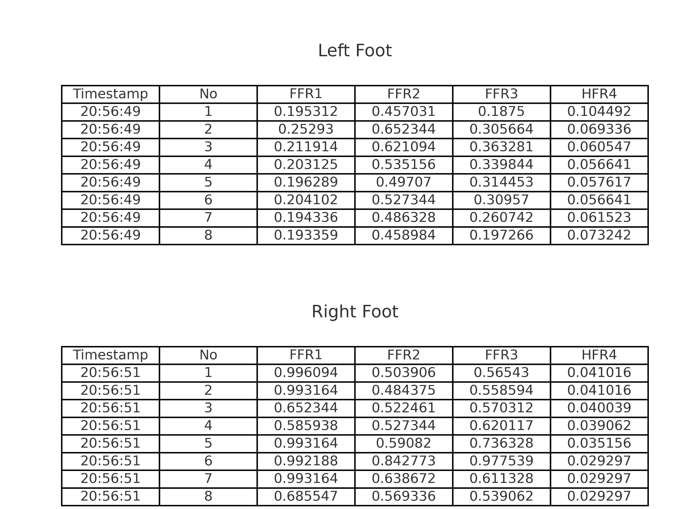
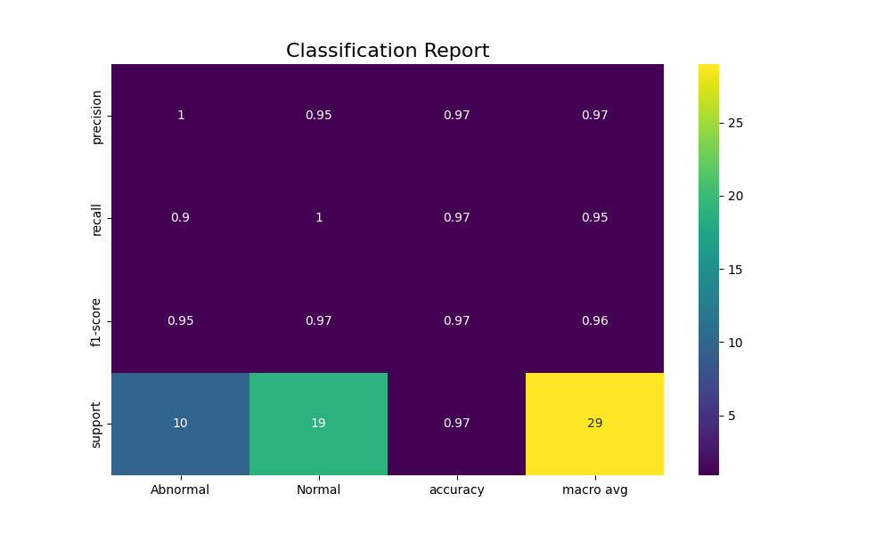
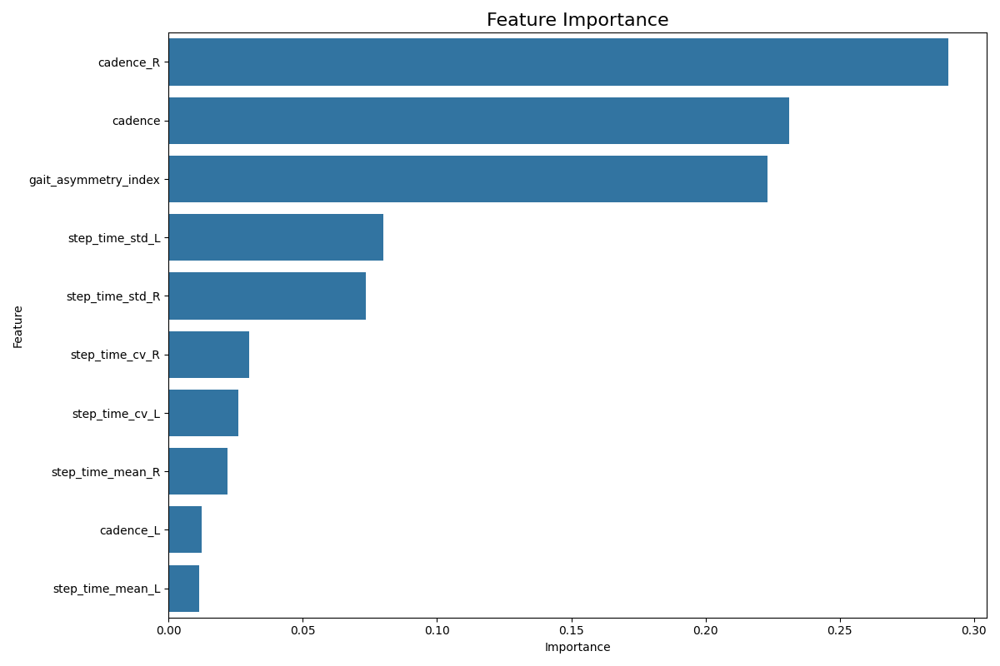
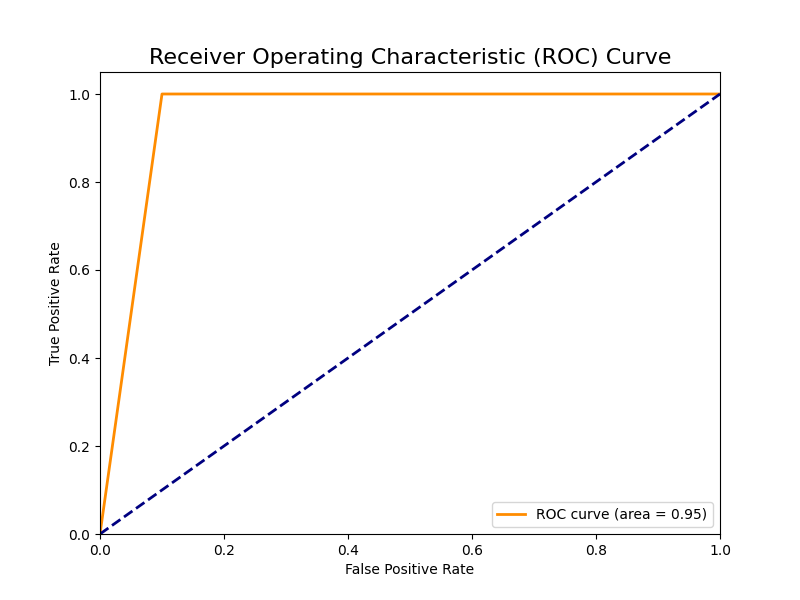

# Bilateral-Plantar-Classifier

**Low-cost bilateral plantar-pressure (FSR) gait classifier** that distinguishes **Normal vs Abnormal** gait using a **Random Forest**.  
**All rights reserved. No human-subject data is included in this repository.**

## What’s in this repo
- `assets/` — non-identifying visuals (e.g., dataset snapshot)
- `model_performance_plots/` — evaluation figures (confusion matrix, report heatmap, feature importance, ROC)
- `reports/` — brief notes/results
- `DATA_POLICY.md` — data handling notes
- `LICENSE` — All rights reserved (no reuse without written permission)

## Data policy (human subjects)
- **No raw participant data is published.**  
- Public assets may include **static, non-identifying snapshots** only.  
- Raw CSVs and metadata are stored privately; available to authorized reviewers on request.

 ## Hardware Overview

This build uses a sandal-mounted bilateral plantar-pressure layout with **four FSRs per foot** (three forefoot, one heel), read by an **Arduino Uno** and streamed to a laptop over USB for logging.

- **Sensors (per foot):** FFR1–FFR3 (forefoot), HFR4 (heel)
- **Interface:** Arduino Uno (analog inputs with fixed resistors as dividers)
- **Host:** Laptop collects serial data; Python script logs to CSV (left/right pairs)
- **Why sandal?** Faster fit, comfort, and consistent placement versus closed shoes

*Fig: Sensing flow — FSRs → Arduino → Laptop.*

**Representative dataset snapshot**

---

## Results (test split)
| Metric | Value |
|---|---|
| Accuracy | **0.9655** |
| Macro-F1 | **0.96** |
| Abnormal (P/R/F1) | **1.00 / 0.90 / 0.95** |
| Normal (P/R/F1) | **0.95 / 1.00 / 0.97** |
| ROC–AUC | **0.95** |

**Evaluation figures**

- Confusion Matrix  
  

- Classification Report (heatmap)  
  

- Feature Importance  
  

- ROC Curve  
  

---

## Project highlights
- **Affordable hardware**: 4 FSRs per foot; sandal form factor for comfort and quick fit.
- **Simple classical ML**: Random Forest baseline with strong performance on held-out set.
- **Reproducible features**: cadence, gait asymmetry index, step-time stats (mean/std/CV) from bilateral signals.
- **Ethical handling**: informed consent collected; data kept private; only derived summaries are shared.

## Want to review full code/data?
To request access (e.g., for an interview or committee review), please contact: **mdtarikanvar.cuj@gmail.com .  
A private repo with code and non-identifying artifacts is available on request.

