# Bilateral-Plantar-Classifier

**Low-cost bilateral plantar-pressure (FSR) gait classifier** that distinguishes **Normal vs Abnormal** gait using a **Random Forest**, extended with **questionnaire-based behavioral hypothesis analysis** in Project 2.  
**All rights reserved. No raw human-subject data is included in this repository.**


## Overview

This repository contains two connected final-year project stages:

- **Project 1**: a wearable bilateral plantar-pressure gait classifier built from sandal-mounted FSR sensors, Arduino-based logging, bilateral feature engineering, and Random Forest classification.
- **Project 2**: an extension that adds questionnaire-based behavioral analysis and hypothesis formulation to study how anxiety, stage phobia, discipline, activity level, and self-described walking traits may relate to gait abnormality.

The project moves from **sensor-based gait recognition** to a broader **biomechanical + behavioral interpretation** of walking patterns.


## What’s in this repo

- `src/pipeline/` — data collection, feature extraction, training, and evaluation scripts for Project 1
- `src/tools/` — questionnaire analysis and figure-generation scripts for Project 2
- `assets/` — non-identifying visuals used in the documentation
- `model_performance_plots/` — Project 1 evaluation figures (confusion matrix, report heatmap, feature importance, ROC)
- `reports/` — report text, Project 2 hypothesis write-up, and generated questionnaire figures
- `questionairre.csv` — questionnaire responses used for the Project 2 extension
- `DATA_POLICY.md` — data handling notes
- `LICENSE` — All rights reserved (no reuse without written permission)


## Project 1 at a Glance

Project 1 uses a sandal-mounted bilateral plantar-pressure layout with **four FSRs per foot** (three forefoot, one heel), read by an **Arduino Uno** and streamed to a laptop over USB for logging.

- **Sensors (per foot):** FFR1–FFR3 (forefoot), HFR4 (heel)
- **Interface:** Arduino Uno (analog inputs with fixed resistors as dividers)
- **Host:** Laptop collects serial data; Python script logs to CSV (left/right pairs)
- **Why sandal?** Faster fit, comfort, and consistent placement versus closed shoes

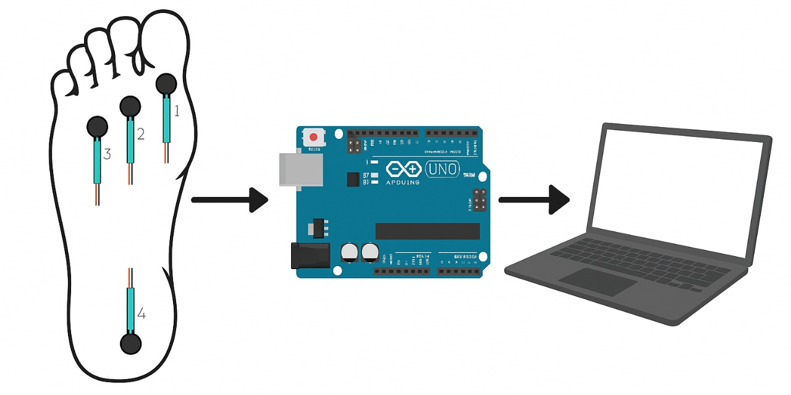

*Fig: Sensing flow — FSRs → Arduino → Laptop.*


## Project 1 Dataset Snapshot

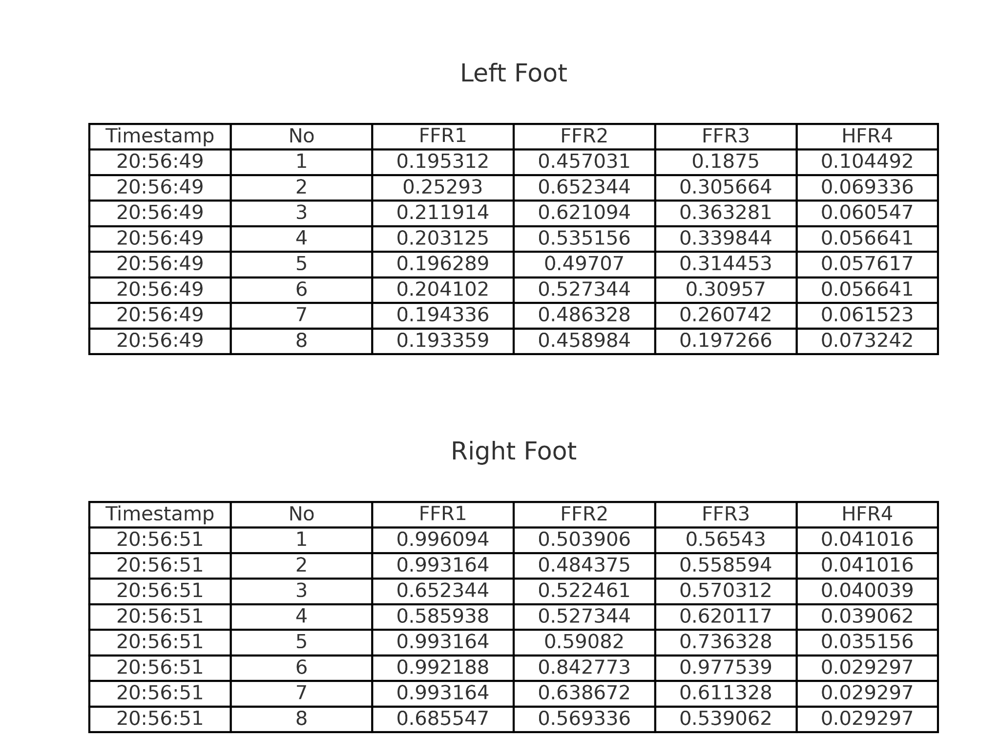

---
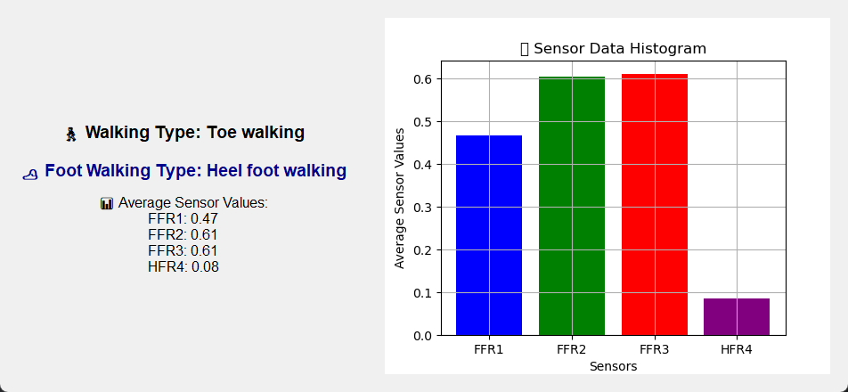


*Figure: Data-collection UI generated immediately after saving a 60-second trial. The left pane shows the heuristic summary (“Walking Type”, “Foot Walking Type”) and per-sensor means; the right pane is a bar chart of normalized FSR averages for FFR1–FFR3 (forefoot) and HFR4 (heel).*


## Project 1 Results (Test Split)

| Metric | Value |
|---|---|
| Accuracy | **0.9655** |
| Macro-F1 | **0.96** |
| Abnormal (P/R/F1) | **1.00 / 0.90 / 0.95** |
| Normal (P/R/F1) | **0.95 / 1.00 / 0.97** |
| ROC–AUC | **0.95** |

### Evaluation Figures

- Confusion Matrix  
  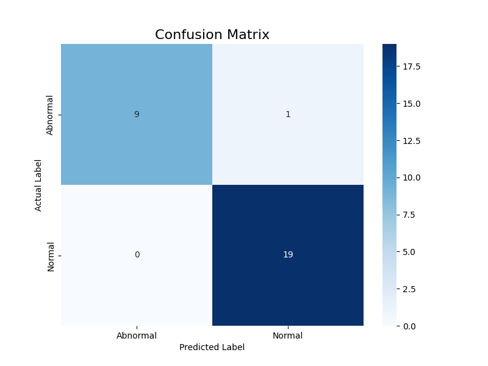

- Classification Report (heatmap)  
  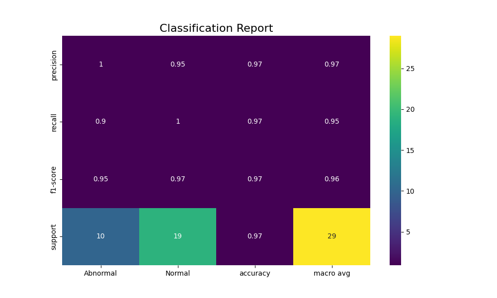

- Feature Importance  
  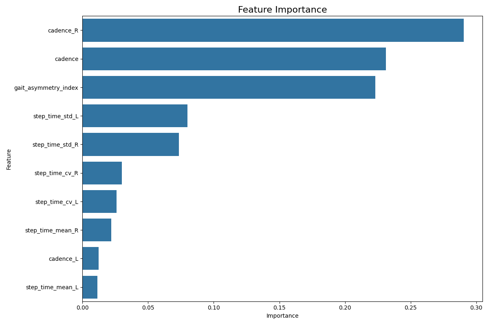

- ROC Curve  
  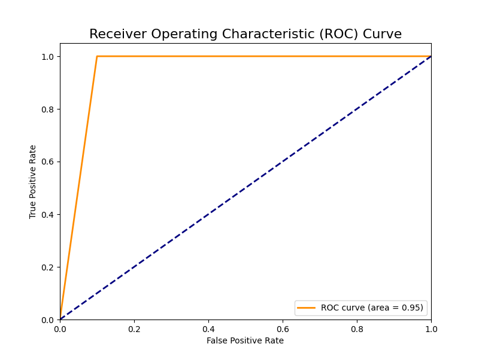


## Project 2 Extension: Questionnaire-Based Behavioral Analysis

Project 2 extends the gait classifier by introducing a questionnaire-based behavioral analysis layer. The goal is to explore whether psychological and lifestyle factors may be associated with gait abnormality and to make the study more interpretable beyond sensor-only classification.

### Questionnaire Overview

The questionnaire captures:

- physical activity level
- self-rated personality traits
- walking speed and walking style
- anxiety-related problems
- stage phobia
- crowd-related behavior
- injury history
- self-perceived visible traits in walking

The questionnaire file currently contains **97 participants**.

### Hypothesis Framework

The extension is organized around five hypotheses:

| Hypothesis | Questionnaire Factor | Expected Relationship |
|---|---|---|
| H1 | Anxiety-related problem | Anxiety may be linked to abnormal gait |
| H2 | Stage phobia | Stage phobia may be linked to abnormal gait |
| H3 | Organization and discipline | Higher scores may be linked to normal gait |
| H4 | Physical activity level | Sedentary participants may show abnormal gait |
| H5 | Visible trait in walk | Positive/stable traits may be linked to normal gait |

### Questionnaire Descriptive Results

| Item | Value |
|---|---:|
| Total participants | 97 |
| Physical activity: Moderate | 50 |
| Physical activity: Active | 37 |
| Physical activity: Sedentary | 10 |
| Walking speed: moderate | 63 |
| Walking speed: fast | 34 |
| Organization score mean | 3.52 |
| Organization score >= 3 | 87 |
| Organization score <= 2 | 10 |
| Anxiety: yes | 24 |
| Anxiety: no | 68 |
| Anxiety: maybe | 5 |
| Stage phobia: yes | 8 |
| Stage phobia: no | 80 |
| Stage phobia: maybe | 9 |
| Injury history: yes | 3 |
| Injury history: no | 94 |

### Generated Project 2 Figures

The following figures are generated from `questionairre.csv` and support the Project 2 discussion:

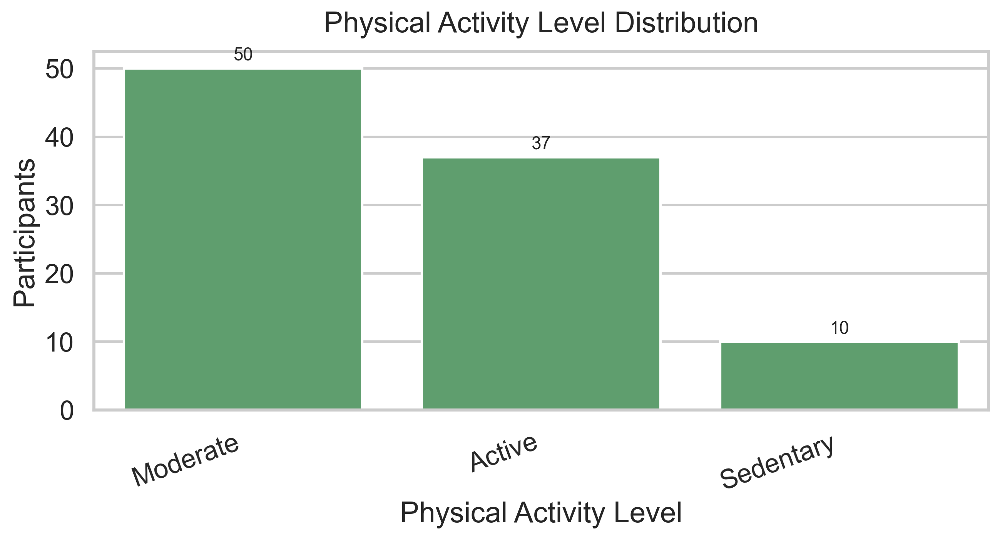

*Figure: Physical activity level distribution among participants.*

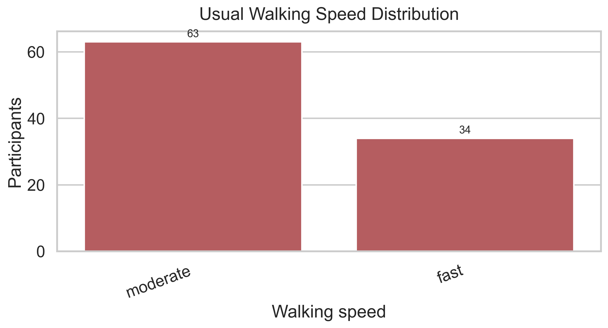

*Figure: Usual walking speed distribution among participants.*

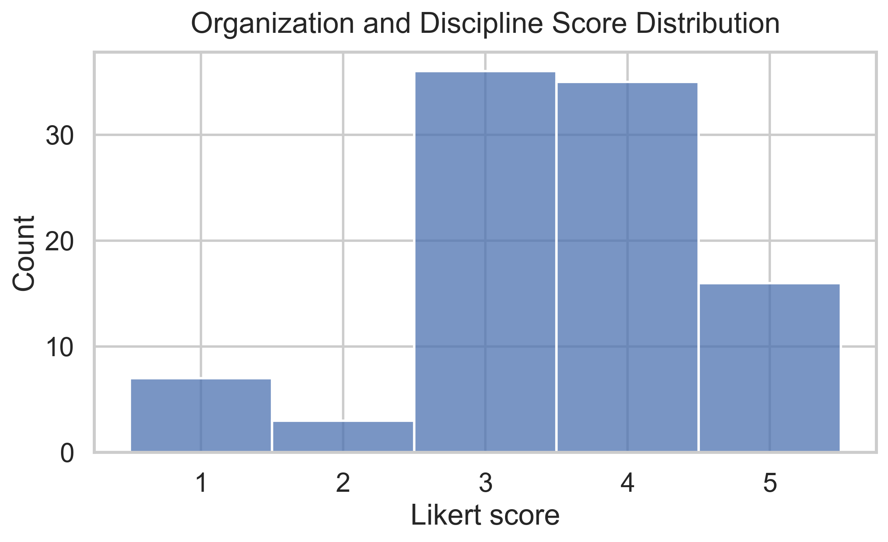

*Figure: Organization and discipline score distribution on the Likert scale.*

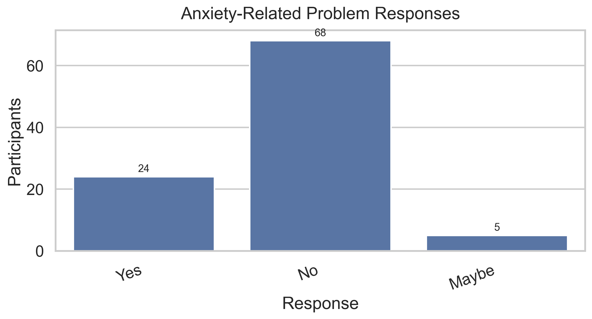

*Figure: Responses to the anxiety-related problem question.*

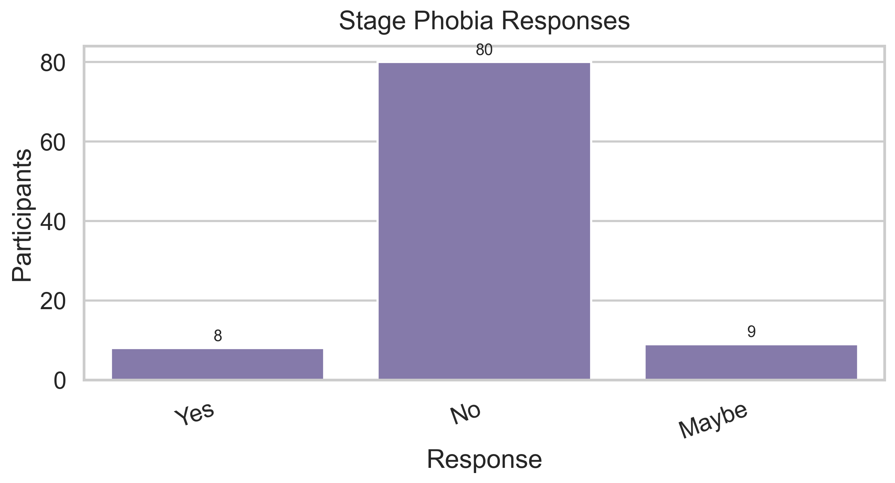

*Figure: Responses to the stage phobia question.*

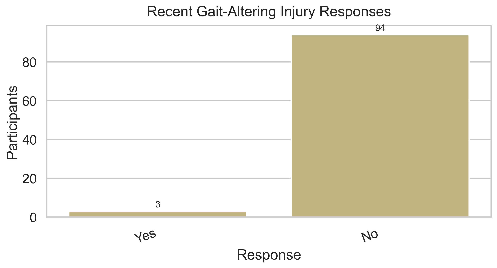

*Figure: Responses to the recent gait-altering injury question.*

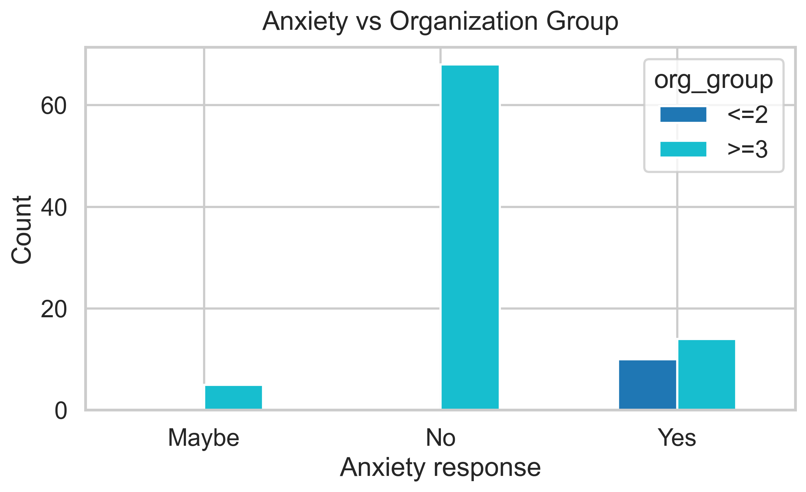

*Figure: Comparison of anxiety responses across organization score groups.*

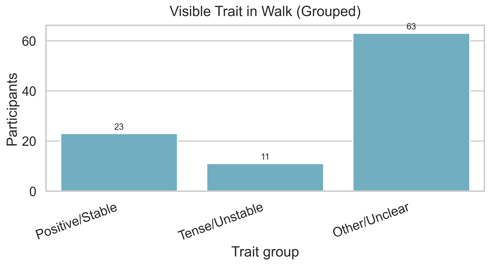

*Figure: Grouped distribution of self-described visible traits in walking style.*

### Project 2 Scripts

- `src/tools/analyze_questionnaire.py` — computes questionnaire summary statistics and writes `reports/questionnaire_analysis.txt`
- `src/tools/generate_project2_figures.py` — generates the questionnaire figures in `reports/project2_figures/`


## Project Highlights

- **Affordable hardware:** 4 FSRs per foot; sandal form factor for comfort and quick fit.
- **Simple classical ML:** Random Forest baseline with strong performance on held-out set.
- **Reproducible features:** cadence, gait asymmetry index, step-time stats (mean/std/CV) from bilateral signals.
- **Behavioral extension:** questionnaire-driven hypothesis analysis adds a psychological interpretation layer.
- **Ethical handling:** informed consent collected; data kept private; only derived summaries and non-identifying visuals are shared.


## Quickstart (Local Run)

```bash
# 1) Create & activate a Python env
python -m venv .venv && source .venv/bin/activate   # Windows: .venv\Scripts\activate

# 2) Install dependencies
pip install -r requirements.txt

# 3) Place your private CSV pairs locally (not in repo), e.g.:
#    gait_data/<subject>_left.csv  and  gait_data/<subject>_right.csv

# 4) Build features (merges L/R, finds heel strikes, computes cadence/GAI/step-time)
python src/pipeline/01_create_features.py

# 5) Train the Random Forest (stratified 70/30 split, random_state=42)
python src/pipeline/02_train_modelrandom_forest.py

# 6) Save evaluation figures (Confusion Matrix, Report Heatmap, Feature Importance, ROC)
python src/pipeline/03_evaluate_model.py

# 7) Run questionnaire analysis for Project 2
python src/tools/analyze_questionnaire.py

# 8) Generate Project 2 questionnaire figures
python src/tools/generate_project2_figures.py
```

**Tested environment:** Python 3.11 on Windows 10; also runs on Linux/macOS with `pip install -r requirements.txt`.


## Protocol (For Reviewers)

- Split: **70/30 stratified**, `random_state=42`
- Model: **RandomForest**, `n_estimators=100`, `class_weight='balanced'`
- ROC positive class: **Normal**
- Project 2 analysis: descriptive questionnaire statistics, hypothesis formulation, and planned cross-tab / chi-square / logistic-regression validation


## Repository Map

- `src/pipeline/00_gait_collect.py` — (Optional) Arduino → CSV logger GUI for 60s trials
- `src/pipeline/01_create_features.py` — Merge L/R CSVs, detect heel strikes, compute cadence/GAI/step-time, write `master_features_dataset.csv`
- `src/pipeline/02_train_modelrandom_forest.py` — Train Random Forest (70/30 stratified, `random_state=42`) and print metrics
- `src/pipeline/03_evaluate_model.py` — Save plots (Confusion Matrix, Classification Report heatmap, Feature Importance, ROC) to `model_performance_plots/`
- `src/tools/analyze_questionnaire.py` — Summarize questionnaire statistics for Project 2
- `src/tools/generate_project2_figures.py` — Generate Project 2 questionnaire plots
- `reports/` — Report text, Project 2 hypothesis write-up, questionnaire analysis output, and generated figures
- `assets/` — Images used in documentation
- `model_performance_plots/` — Generated evaluation figures for Project 1


## Data Policy (Human Subjects)

- **No raw participant data is published.**  
- Public assets may include **static, non-identifying snapshots** only.  
- Raw CSVs and metadata are stored privately; available to authorized reviewers on request.


## Request Data Access / Contact

This repo intentionally excludes human-subject raw data.  
If you’d like to review a short de-identified sample or discuss the project:

- Open a GitHub **Issue** titled “Access request” with your affiliation/purpose, or  
- Email me at mdtarikanvar.cuj@gmail.com or message via your [LinkedIn profile](https://www.linkedin.com/in/tarik-anvar/).

I’m happy to demo the full pipeline live (data capture → features → model → evaluation → questionnaire extension).


