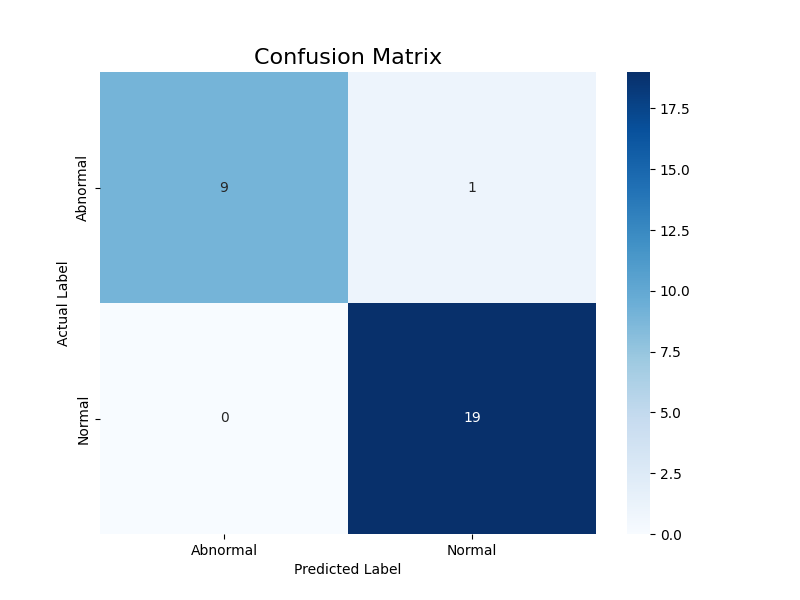

# Bilateral-Plantar-Classifier

**Low-cost bilateral plantar-pressure (FSR) gait classifier** that distinguishes **Normal vs Abnormal** gait using a **Random Forest**.  
**All rights reserved. No human-subject data is included in this repository.**


## What’s in this repo
- `assets/` — non-identifying visuals (e.g., dataset snapshot)
- `model_performance_plots/` — evaluation figures (confusion matrix, report heatmap, feature importance, ROC)
- `reports/` — brief notes/results
- `DATA_POLICY.md` — data handling notes
- `LICENSE` — All rights reserved (no reuse without written permission)

## Data policy (human subjects)
- **No raw participant data is published.**  
- Public assets may include **static, non-identifying snapshots** only.  
- Raw CSVs and metadata are stored privately; available to authorized reviewers on request.

## Request data access / Contact

This repo intentionally excludes human-subject raw data.  
If you’d like to review a short de-identified sample or discuss the project:

- Open a GitHub **Issue** titled “Access request” with your affiliation/purpose, or  
- Email me at mdtarikanvar.cuj@gmail.com or message via your https://www.linkedin.com/in/tarik-anvar/  .

I’m happy to demo the full pipeline live (data capture → features → model → evaluation).


 ## Hardware Overview

This build uses a sandal-mounted bilateral plantar-pressure layout with **four FSRs per foot** (three forefoot, one heel), read by an **Arduino Uno** and streamed to a laptop over USB for logging.

- **Sensors (per foot):** FFR1–FFR3 (forefoot), HFR4 (heel)
- **Interface:** Arduino Uno (analog inputs with fixed resistors as dividers)
- **Host:** Laptop collects serial data; Python script logs to CSV (left/right pairs)
- **Why sandal?** Faster fit, comfort, and consistent placement versus closed shoes


*Fig: Sensing flow — FSRs → Arduino → Laptop.*


## Representative dataset snapshot


---


*Figure: Data-collection UI generated immediately after saving a 60-second trial. The left pane shows the heuristic summary (“Walking Type”, “Foot Walking Type”) and per-sensor means; the right pane is a bar chart of normalized FSR averages for FFR1–FFR3 (forefoot) and HFR4 (heel).*


## Results (test split)
| Metric | Value |
|---|---|
| Accuracy | **0.9655** |
| Macro-F1 | **0.96** |
| Abnormal (P/R/F1) | **1.00 / 0.90 / 0.95** |
| Normal (P/R/F1) | **0.95 / 1.00 / 0.97** |
| ROC–AUC | **0.95** |

## Evaluation figures

- Confusion Matrix  
  

- Classification Report (heatmap)  
  

- Feature Importance  
  

- ROC Curve  
  

---

## Project highlights
- **Affordable hardware**: 4 FSRs per foot; sandal form factor for comfort and quick fit.
- **Simple classical ML**: Random Forest baseline with strong performance on held-out set.
- **Reproducible features**: cadence, gait asymmetry index, step-time stats (mean/std/CV) from bilateral signals.
- **Ethical handling**: informed consent collected; data kept private; only derived summaries are shared.

## Quickstart (local run)

```bash
# 1) Create & activate a Python env
python -m venv .venv && source .venv/bin/activate   # Windows: .venv\Scripts\activate

# 2) Install dependencies
pip install -r requirements.txt

# 3) Place your private CSV pairs locally (not in repo), e.g.:
#    gait_data/<subject>_left.csv  and  gait_data/<subject>_right.csv

# 4) Build features (merges L/R, finds heel strikes, computes cadence/GAI/step-time)
python src/pipeline/01_create_features.py

# 5) Train the Random Forest (stratified 70/30 split, random_state=42)
python src/pipeline/02_train_modelrandom_forest.py

# 6) Save evaluation figures (Confusion Matrix, Report Heatmap, Feature Importance, ROC)
python src/pipeline/03_evaluate_model.py

```
**Tested environment:** Python 3.11 on Windows 10; also runs on Linux/macOS with `pip install -r requirements.txt`.


## Protocol (for reviewers)

- Split: **70/30 stratified**, `random_state=42`
- Model: **RandomForest**, `n_estimators=100`, `class_weight='balanced'`
- ROC positive class: **Normal**


## Repository map

- `src/pipeline/00_gait_collect.py` — (Optional) Arduino → CSV logger GUI for 60s trials
- `src/pipeline/01_create_features.py` — Merge L/R CSVs, detect heel strikes, compute cadence/GAI/step-time, write `master_features_dataset.csv`
- `src/pipeline/02_train_modelrandom_forest.py` — Train Random Forest (70/30 stratified, `random_state=42`) and print metrics
- `src/pipeline/03_evaluate_model.py` — Save plots (Confusion Matrix, Classification Report heatmap, Feature Importance, ROC) to `model_performance_plots/`
- `reports/` — Paper/report materials
- `assets/` — Images used in documentation
- `model_performance_plots/` — Generated evaluation figures


